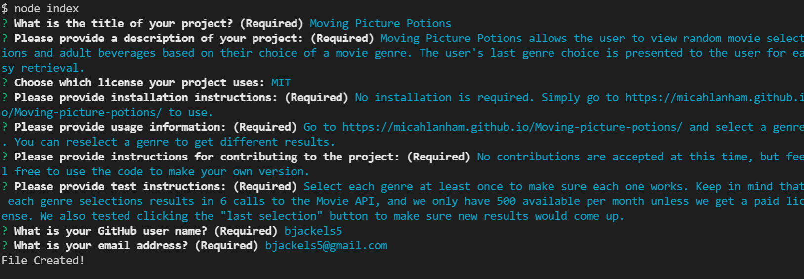
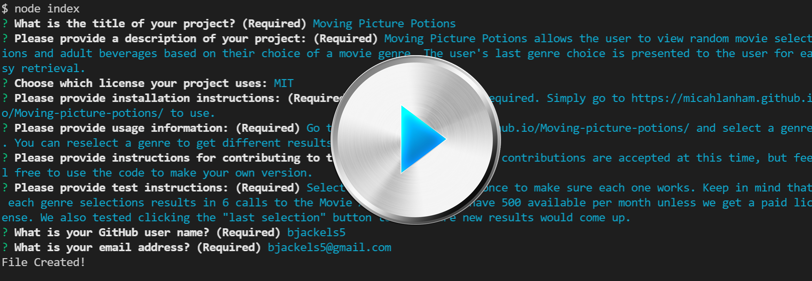

# README Generator
This challenge for Module 9 of the Coding Bootcamp is to create a professional README generator that prompts the user for input via a command line interface.

---

* [Requirements](#requirements)

* [Technologies Used](#techUsed)

* [What I Learned](#whatILearned)

* [README Generator Screenshot](#appScreenshot)

* [Sample Generated README](#sampleOutput)

* [README Generator Demo](#projectDemo)

* [Contact Me](#contactMe)

---

## Requirements

* Must be a command-line application that accepts user input
* Must prompt the user for the following data:
    * Project Title
    * Project Description
    * License
    * Installation Instructions
    * Usage Instructions
    * Contribution Instructions
    * Testing Instructions
    * How to contact the user with questions via GitHub and email.
* The generated README must have corresponding sections for each of the prompted data points.
* The generated README must have a table of contents.
* The Project Title is displayed as the title of the README.
* If a license is chosen, a badge for the license is added near the top of the README and a section is added that gives details on the license.

---

## Technologies Used

* Node
* inquirer
* fs

---

## I learned how to...
* Build interactive command-line applications that process user input
* Explain modularization and how it relates to npm and the Node.js standard library
* Initialize new Node.js projects with npm, and install and import dependencies
* Explain the importance and usefulness of ES6+ concepts such as let, const, and arrow functions
* Handle asynchronicity with callbacks and Promises
* Use inquirer and its Promise.
* Search the npm registry to find stable long-term solutions.
* Work with data more efficiently, using new JavaScript features and array methods.
* Use Node.js’s modularity to keep the functionality clean and easy to read.
* How to use the fs module to copy files from one location to another and to create new files.
* How to use template literals.

---

## README Generator Screenshot

---

<a href="./dist/README.md">Sample Generated README</a>

---

## README Generator Demo

---

## Contact Me
You can reach me, Brenda Jackels, at bjackels5@gmail.com.
